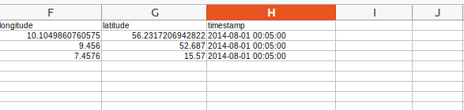
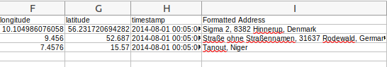
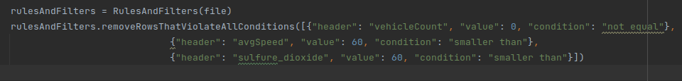
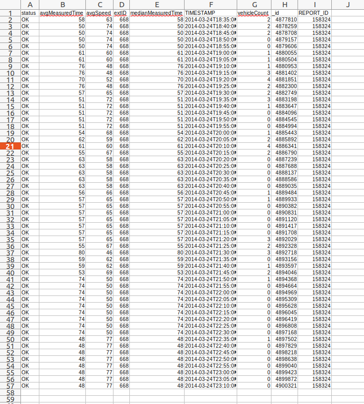
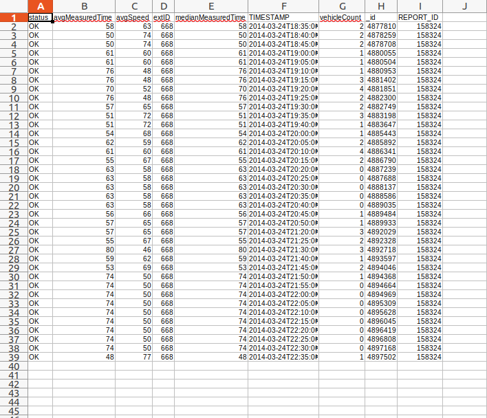

# CSV-Modificator
### A brief explanation about each method and its arguments    

------------------------------------------------------
**createFormattedAddressColumn method : **

 
Calling this classmethod on CSV files which include data referring to a physical location (E.g. "latitude" and "longitude" as the initial data of a location) will add a new column called: "Formatted Address" containing the formatted address of the initial location. An example of this method's function is given below:
   
initial .CSV file :
 

final .CSV file :
 

  

A SQL database containing initial and formatted addresses of location is created for higher effiency:
 

  

------------------------------------------------------

**removeRowsThatViolateAllConditions method : **

 
Calling this classmethod on CSV files, will filter rows based on the conditions that are given (E.g. "vehicleCount" msut not be 0), for instance in case method depicted in image above is called, rows that their "vehicleCount" value is equal to 0 **and** their "avgSpeed" value is larger than 60 **and** their "sulfure_dioxide" value is larger than 60 will be removed. If rows lack the given headers, related filter will be ignored and other filters will be applied.
   
initial .CSV file :
 

final .CSV file :
 

  
